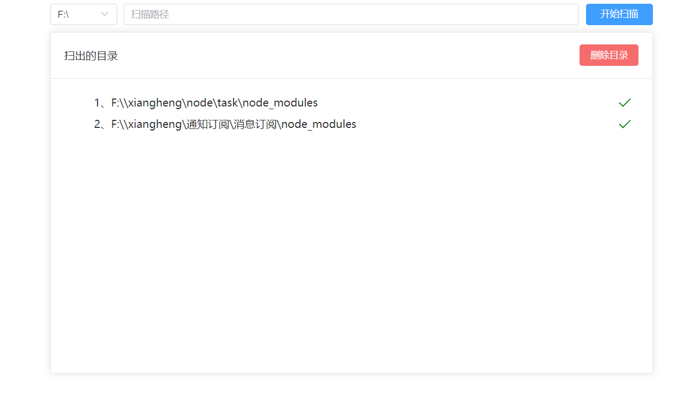

# 使用方式
### 1、直接下载打包文件
https://github.com/adtkcn/clear/releases

### 2、源码打包方式
```bash
go mod tidy #移除不需要的模块
go get
go build -ldflags "-s -w" #其中 -ldflags 里的 -s 去掉符号信息， -w 去掉 DWARF 调试信息，不能用 gdb 调试了
./upx.exe ./clear.exe #压缩文件
./clear.exe #运行或者双击运行
```

